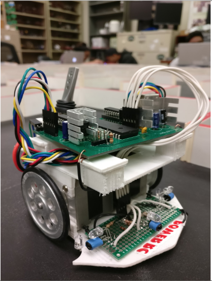
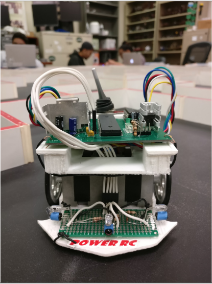
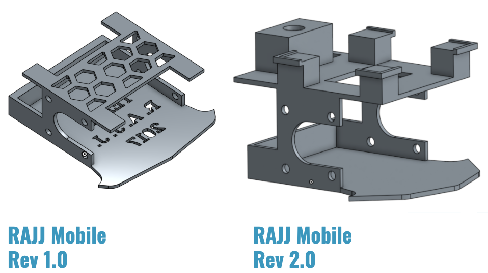
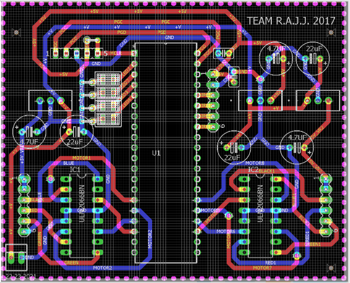

  
  
  
  

Micromouse is an event where small robot “mice” solve a 16 x 16 maze. The maze is made up of a 16 by 16 grid of cells, each 180 mm square with walls 50 mm high.  The mice are completely autonomous robots that must find their way from a predetermined starting position to the central area of the maze unaided. There are multitude of different tracking algorithms that can perform this procedure. The goal of this world wide held event is to get to the center of the maze automously with the fastest time unaided. 

For this project, the mice is composed of three subsystems: the drive train, the control system and the sensors. The drive train consists of the chassis and the motors, which in our case we 3D printed our own chassis and utilized stepper motors for our drive train. The control system is what allows the mice to stay straight while traversing the maze without hitting the walls. We were implemented a control algorithm known as K Control. The last subsystem are the sensors which detects the distance of the walls and passes the values to the control system to prevent the mice from going into walls and also relays information to tell the mice when to turn. I started by programming the basics, such as sensor polling and motor actuation using interrupts. I also programmed basic algorithms used to solve the maze such as a right wall hugger. Overall, our mice got the second fastest time in the stepper motor division at our college. 

You can learn more at the [UH Micromouse Website](http://www-ee.eng.hawaii.edu/~mmouse/about.html).

