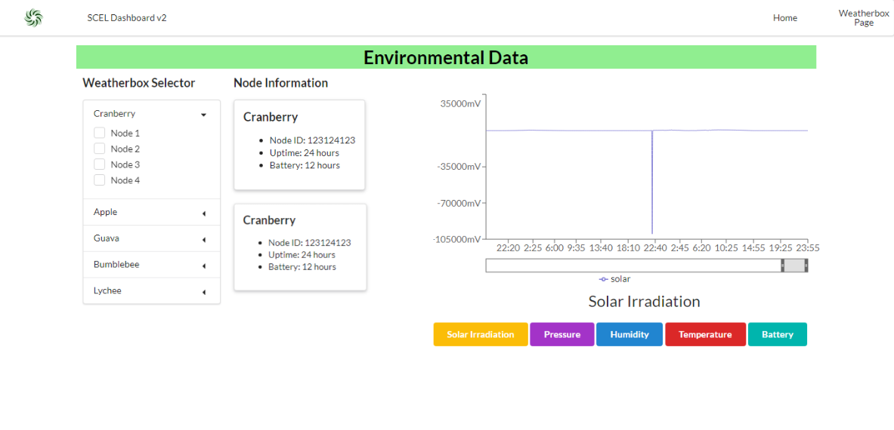

The Smart Campus Energy Lab (SCEL) is one of many research laboratories within the Renewable Energy Island Sustainability (REIS) group.Our main project is the SCEL Weatherbox.

The objective of this project is to design and develop low-cost, accurate, and reliable environmental sensor modules that can easily be reproduced for mass deployment on rooftops across the University of Hawaii at Manoa campus. The meteorological data collected from these modules will assist in planning future renewable energy installations as well as providing risk mitigation for electricity generation through the development of renewable resource prediction and forecasting algorithms.

I worked on the front-end portion ofthe dashboard for the Smart Campus Energy Lab webpage. I utilized [React.Semantic-ui](https://react.semantic-ui.com) to modify the homepage and data display pages of the dashboard to display the collected data through graphs and charts. And I connected the front-end to the back-end using [Javascript](https://javascript.com). I maintained and added new features to a dashboard written in ReactJS that will interact with the local server to livestream meteorological data. In addition I updated the dashboard, utilizing CSS, HTML, and Semantic UI to create new features for improved user workflow. The goal of this project is to work on the front-end of the dashboard to create a minimum viable product (MVP) for lab users. 
 
