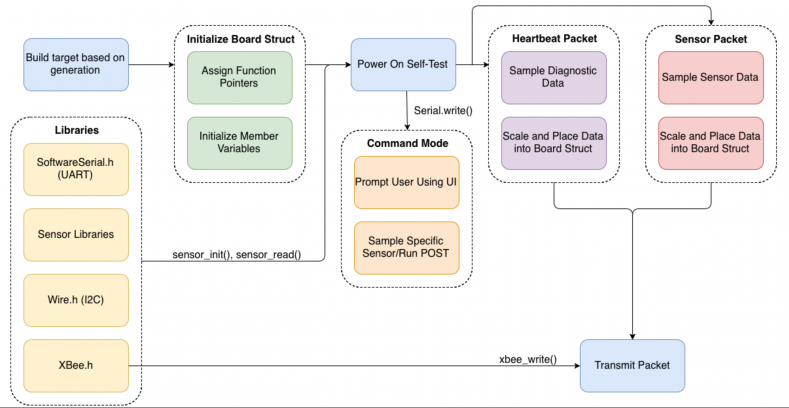

The Smart Campus Energy Lab (SCEL) is one of many research laboratories within the Renewable Energy Island Sustainability (REIS) group.Our main project is the SCEL Weatherbox.

The objective of this project is to design and develop low-cost, accurate, and reliable environmental sensor modules that can easily be reproduced for mass deployment on rooftops across the University of Hawaii at Manoa campus. The meteorological data collected from these modules will assist in planning future renewable energy installations as well as providing risk mitigation for electricity generation through the development of renewable resource prediction and forecasting algorithms.

I implemented new features in the firmware that would allow Real Time Clock and GPS to be enable for the meteorlogical sensor modules. The firmware acts as a connection between the hardware and the dasboard. On the hardware side, RTC and GPS modules are implemented on the device, and my job is to write up code to allow packets of information that is collected from the modules to be passed to the database and then projected to the dashboard. 

To give you a flavor of what is going on, here is some pseudo-code for the algorithm, 

<pre>
Initialization
      Create and initialize board struct
      Set-up board
           Initialize all of the sensors
           Read Node ID from EEPROM
      Run a Power on Self-Test
           Sample each sensor
           Write sensor values to serial monitor
           Check for bad sensor values
           
  Execution
      Heartbeat Packet
           Poll diagnostic data every three seconds for first thirty seconds
           Apply scaling factors to diagnostic data
           Construct heartbeat packet
           Transmit heartbeat packet every three seconds for first thirty seconds
           Write message to indicate successful transmission to serial monitor
      Data Packet
           Poll sensor and diagnostic data every thirty seconds
           Apply scaling factors to diagnostic and sensor data
           Construct data packet
           Transmit data packet every thirty seconds
           Write message to indicate successful transmission to serial monitor
      Command Mode
           Enter any character into the serial monitor to interrupt execution
           Enter “P” into serial monitor to run a Power on Self-Test
           Enter “E” to exit command mode and return to execution
</pre>

Source: <a href="https://github.com/scel-hawaii/control-tower"><i class="large github icon "></i>Control-tower

