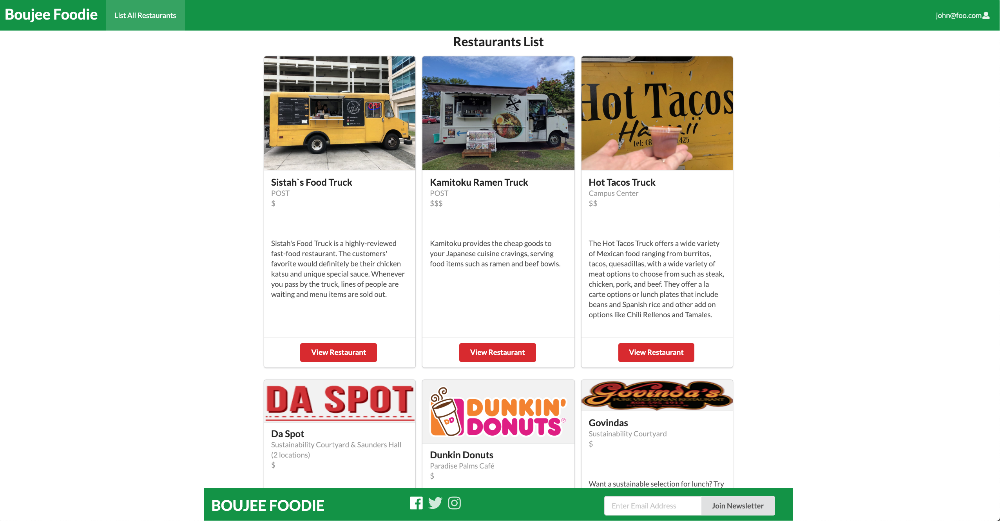

## Overview
There are many food choices on campus: campus center, food trucks, Manoa Gardens, Paradise Palms, vending machines, and so forth. With Boujee Foodie, all users can find nearby restaurants at UH Manoa in no time with a list of reviews that will provide users to see what each restaurant has to offer. 

Boujee Foodie is a website that allows individuals, particularly students and faculty, to view the available restaurants on the UH Manoa. In addition, it specifies the restaurant information for each vendor available, allows users to check community reviews as well as add their own reviews, and locates the various restaurants on campus. 

## Contributions
My contribution for this project included creating the landing page which allow users easy access to see what our web application offers. Within the landing page, users can see the top three restaurants along with their reviews. Another component I helped worked on is the list landing page where users can see all the restaurants that are added in our database. I created the edit pages which allow admin accounts to edit the restaurants. In addition to this, I also help create the collections and helped connect everything together on each page. 

## Learning Outcome
In this project, I was able to learn and gain some experience in working on a team on a small-to-medium scaled project. By doing so, we were able to succesfully build a web application that serves its purpose. I was able to learn and integrate everything I have learned throughout this semester. It was really interesting that we were able to implement Javascript, React, Semantic-UI, MongoDB, and Meteor all together in this project and see it working in unison. After going through this experience, I feel that I have a better understanding of Web Development and how impactful it can be. 

## Screenshots
### Landing Page

### List Restaurant Page

[Organization Github Page](https://github.com/boujeefoodie/boujeefoodie/)
